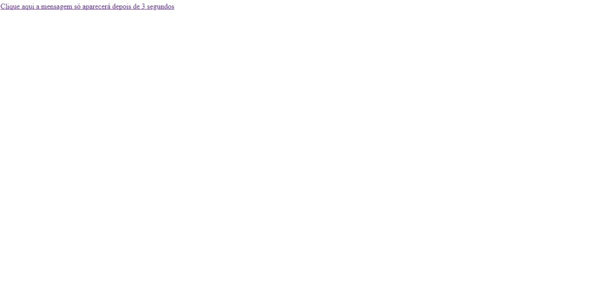
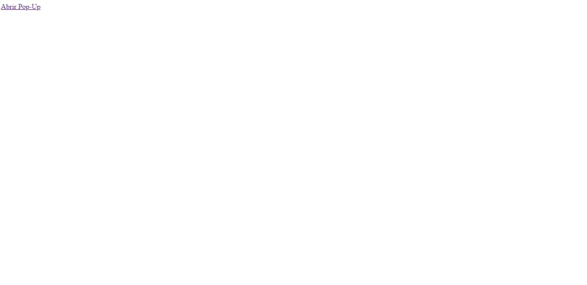

# Análise de código javascript
Este projeto consiste em, utilizando dois códigos disponíveis [aqui](https://terminalroot.com.br/2016/12/alguns-codigos-simples-de-javascript-2.html), analisá-los, implementá-los e testa-los. Após os testes, foi preciso identificar o que cada parte do javascript está fazendo e documentar tudo. Toda a documentação está disponível abaixo.

## Atrasando no tempo 

* analise do código 💻 [tempo.html](/tempo.html)

 `` script type="text/javascript ``: Esta tag indica que o conteúdo é JavaScript.

``<function timeMsg()>``{...}: Define a função timeMsg(). Esta função configura um temporizador para chamar alertMsg() após 3 segundos.
function alertMsg(){...}: Define a função alertMsg(). Esta função escreve "Terminal Root" no documento.

``<document.write("Terminal Root")>;:`` Esta linha escreve "Terminal Root" diretamente no documento HTML. No entanto, tenha em mente que o uso de document.write() após o documento ter sido carregado pode substituir completamente o conteúdo da página. Isso é considerado uma prática desatualizada e geralmente não é recomendado, pois pode causar problemas de acessibilidade e degradação do desempenho.

``<a href="#" onClick="timeMsg() a>``"Clique aqui a mensagem só aparecerá depois de 3 segundos: Este é um link  que, quando clicado, chama a função timeMsg(). Isso resulta na exibição do texto "Terminal Root" após um atraso de 3 segundos. O href="#" é usado para garantir que o link não redirecione para outra página quando clicado. O onClick="timeMsg()" atribui o evento de clique para chamar a função timeMsg() quando o link é clicado.
* o que o código faz?

O atraso de 3 segundos em JavaScript permite que você adie a execução de uma determinada tarefa por um período de tempo específico. Isso pode ser útil em diferentes cenários, como a exibição de uma mensagem temporizada, a realização de uma animação após um intervalo de tempo ou a implementação de um cronômetro.

# Abrir Pop-Up no Centro da Página 

* analise do código

````: Indica o fim do bloco de script JavaScript.

``<a href="https://github.com/dashboard" onclick="NovaJanela(this.href,'nomeJanela','820','560','yes');return false">Abrir Pop-Up</a>: Este é um link <a>`` que, quando clicado, chama a função NovaJanela() com os parâmetros apropriados para abrir uma nova janela com a URL especificada ("https://github.com/dashboard"), um nome ("nomeJanela"), largura (820 pixels), altura (560 pixels) e barras de rolagem visíveis. O return false é usado para evitar que o link redirecione o navegador para a URL especificada. Em vez disso, a função NovaJanela() é chamada para lidar com a abertura da nova janela.